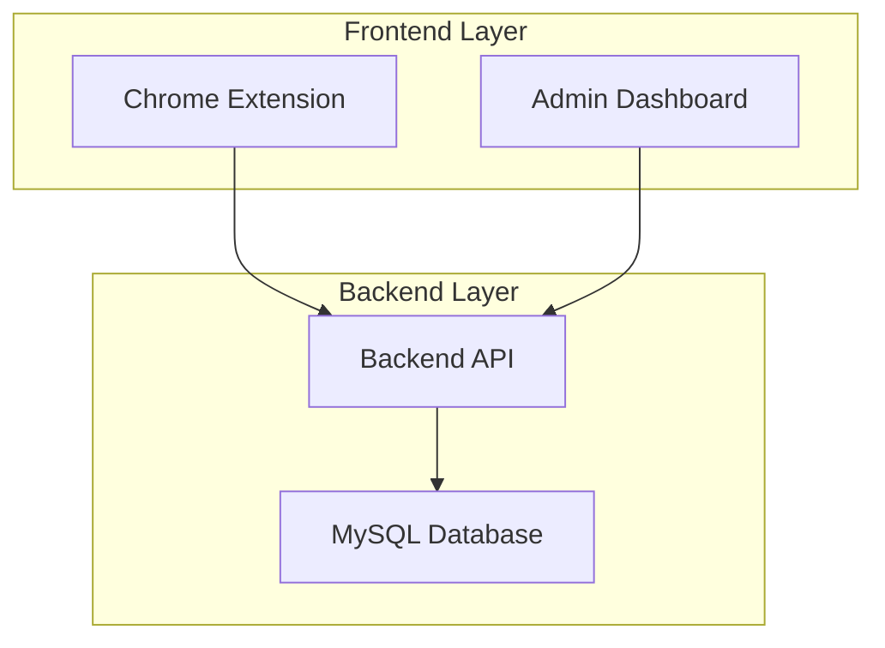

# 🔐 Chrome Pass

> **A secure password sharing and autofill system for teams**

Chrome Pass is a comprehensive solution for secure password sharing within teams, featuring a robust backend API, intuitive admin dashboard, and seamless Chrome extension integration.

[](https://nodejs.org/)
[](https://reactjs.org/)
[](https://mysql.com/)
[](https://chrome.google.com/webstore)

## 🚀 Quick Start

```bash
# 1. Clone the repository
git clone https://github.com/yourusername/chrome-pass.git
cd chrome-pass

# 2. Install all dependencies
npm run install:all

# 3. Set up the database
cd backend
cp env.example .env
# Edit .env with your MySQL credentials
npm run setup-db

# 4. Start all services
cd ..
npm run dev

# 5. Install Chrome extension
# Open Chrome → Extensions → Developer mode → Load unpacked → Select chrome-extension folder
```

**Access Points:**
- 🌐 **Admin Dashboard**: http://localhost:3000
- 🔌 **API Server**: http://localhost:3001
- 🔧 **Chrome Extension**: Load from `chrome-extension/` folder

## 📋 Prerequisites

| Component | Requirement |
|-----------|-------------|
| **Node.js** | 18.0 or higher |
| **MySQL** | 8.0 or higher |
| **Chrome Browser** | Version 88 or higher |
| **npm** | 8.0 or higher |

## 🏗️ Architecture



## 🛠️ Components Overview

### 🔌 Backend API
**Location**: [`/backend`](backend/)  
**Technology**: Node.js, Express, Sequelize, MySQL  
**Port**: 3001

**Key Features**:
- JWT-based authentication
- User and team management
- Credential storage and encryption
- Project organization
- RESTful API endpoints

**Quick Setup**: See [Backend README](backend/README.md)

### 🎨 Admin Dashboard
**Location**: [`/admin-frontend`](admin-frontend/)  
**Technology**: React, Tailwind CSS, Axios  
**Port**: 3000

**Key Features**:
- User management interface
- Team and project organization
- Credential management
- Real-time updates
- Responsive design

**Quick Setup**: See [Frontend README](admin-frontend/README.md)

### 🔧 Chrome Extension
**Location**: [`/chrome-extension`](chrome-extension/)  
**Technology**: Vanilla JavaScript, Chrome Extension API

**Key Features**:
- Auto-fill credentials on websites
- Manual credential access
- Secure local storage
- URL pattern matching

**Quick Setup**: See [Extension README](chrome-extension/README.md)

## 🔐 Default Credentials

| Role | Email | Password |
|------|-------|----------|
| **Admin** | `admin@chromepass.com` | `admin123` |
| **User** | `john.doe@company.com` | `password123` |
| **User** | `jane.smith@company.com` | `password123` |

> ⚠️ **Security Note**: Change these default credentials before production use!

## 🚀 Development Commands

```bash
# Install all dependencies
npm run install:all

# Start all services (backend + frontend)
npm run dev

# Start individual services
npm run backend:dev    # Backend only (port 3001)
npm run admin:dev      # Frontend only (port 3000)

# Build for production
npm run build
```

## 📊 Key Features

### 🔒 Security
- **Password Hashing**: bcrypt with salt rounds
- **JWT Authentication**: Secure token-based auth
- **CORS Protection**: Configurable cross-origin policies
- **Rate Limiting**: API request throttling
- **Input Validation**: Joi schema validation
- **HTTPS Support**: Production-ready security

### 👥 Team Management
- **User Roles**: Admin and user permissions
- **Team Organization**: Group-based access control
- **Project Categorization**: Organize credentials by projects
- **Access Control**: Granular permission management

### 🌐 Chrome Integration
- **Auto-fill**: Automatic credential filling on websites
- **URL Matching**: Flexible pattern-based matching
- **Manual Access**: Browse and select credentials
- **Secure Storage**: Encrypted local storage

### 📱 User Experience
- **Responsive Design**: Works on all devices
- **Real-time Updates**: Live data synchronization
- **Intuitive Interface**: Easy-to-use admin dashboard
- **Quick Actions**: One-click credential filling

## 📚 Documentation

| Component | Documentation | Description |
|-----------|---------------|-------------|
| **Backend** | [Backend README](backend/README.md) | API setup, endpoints, database schema |
| **Frontend** | [Frontend README](admin-frontend/README.md) | React setup, components, state management |
| **Extension** | [Extension README](chrome-extension/README.md) | Chrome extension setup and usage |
| **Utilities** | [Extras README](.extras/README.md) | Development utilities and scripts |

## 🚀 Production Deployment

### 1. Database Setup
```bash
# Create production MySQL database
CREATE DATABASE chrome_pass_prod CHARACTER SET utf8mb4 COLLATE utf8mb4_unicode_ci;
```

### 2. Environment Configuration
```bash
# Backend environment
NODE_ENV=production
DB_HOST=your-production-db-host
DB_PASSWORD=your-secure-password
JWT_SECRET=your-super-secure-jwt-secret
```

### 3. Build and Deploy
```bash
# Build frontend
npm run admin:build

# Start backend
npm run backend:start

# Deploy Chrome extension to Chrome Web Store
```

## 🤝 Contributing

We welcome contributions! Please follow these steps:

1. **Fork** the repository
2. **Create** a feature branch (`git checkout -b feature/amazing-feature`)
3. **Commit** your changes (`git commit -m 'Add amazing feature'`)
4. **Push** to the branch (`git push origin feature/amazing-feature`)
5. **Open** a Pull Request

### Development Guidelines
- Follow existing code style
- Add tests for new features
- Update documentation
- Test all components thoroughly

## 📄 License

This project is licensed under the MIT License - see the [LICENSE](LICENSE) file for details.

## 🆘 Support & Troubleshooting

### Common Issues
1. **Database Connection**: Check MySQL credentials and connection
2. **Port Conflicts**: Ensure ports 3000 and 3001 are available
3. **Extension Loading**: Enable Developer mode in Chrome
4. **API Errors**: Check backend logs and CORS settings

### Getting Help
1. 📖 Check the component-specific README files
2. 🔧 Review the [Development Utilities](.extras/README.md)
3. 🐛 Search existing [Issues](https://github.com/yourusername/chrome-pass/issues)
4. 💬 Create a new issue with detailed information

## 🌟 Features Roadmap

- [ ] Mobile app support
- [ ] Two-factor authentication
- [ ] Advanced password policies
- [ ] Audit logging
- [ ] API rate limiting dashboard
- [ ] Multi-language support

## 📊 Project Stats


---

<div align="center">

**Made with ❤️ for secure team collaboration**

[⭐ Star this repo](https://github.com/yourusername/chrome-pass) | [🐛 Report Bug](https://github.com/yourusername/chrome-pass/issues) | [💡 Request Feature](https://github.com/yourusername/chrome-pass/issues)

</div>